# 台风集合预报(概率预报)路径系统后台
* 前台目前改为私有仓库不再公开
* 靠爱发电，只做展示示意 
* ps: 21-12-07 今年职称又没戏了，不过明年又是新的一年，加油 `(*^▽^*)`
* 2022年了，卧槽燃起来了  
 -  22-01-26  v1.5 版本基本完成，上线还差最后一步环节，前两天身体还是不行了烧到了38.9感觉确实不太好。这个系统开发也有8个月了，期间遭遇过返工，重构以及同事的质疑，不过不管怎么样，坚持做下去，就可以了！在nmefc做开发是一件孤独的事情，不过坚持下来回过头看还是有很多收获，加油！  
 ###  如有共同志向的想伙伴希望可以加入我们，我们的口号是真爱无价靠艾发电~

## 项目文档:
[前端README](./documents/client_readme.md)
[部署README](./documents/项目部署.md)
## 项目架构及所用到的技术
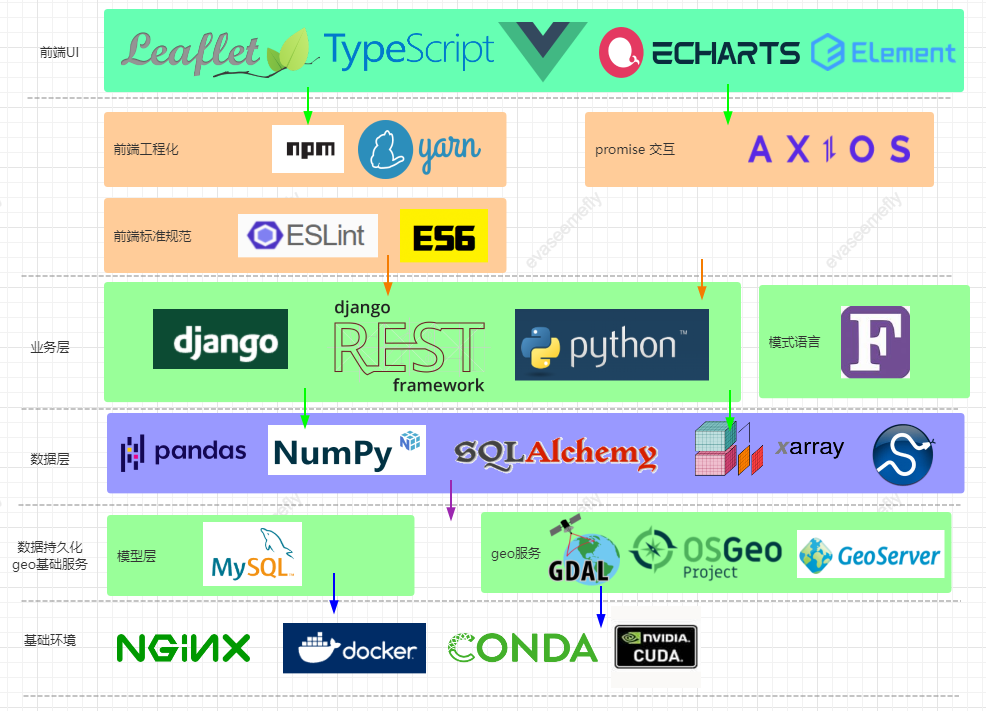
## 项目预览
+ 21-10-15 目前上线测试的 v1.0 版本预览如下:
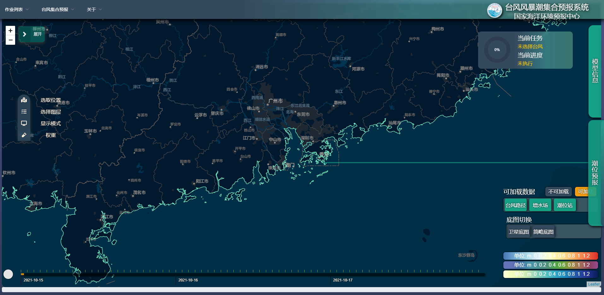
创建台风基础信息
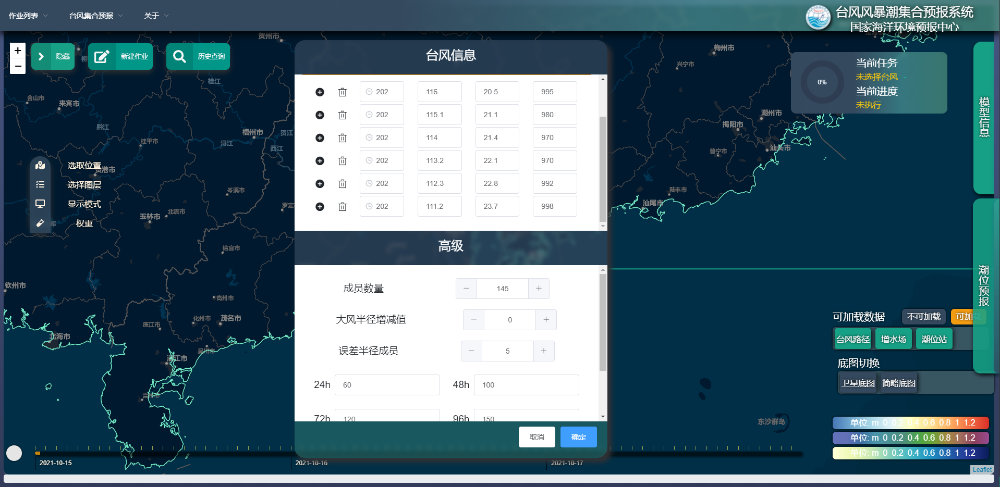
历史创建case搜索栏

选择创建的case加载台风集合(概率)预报路径
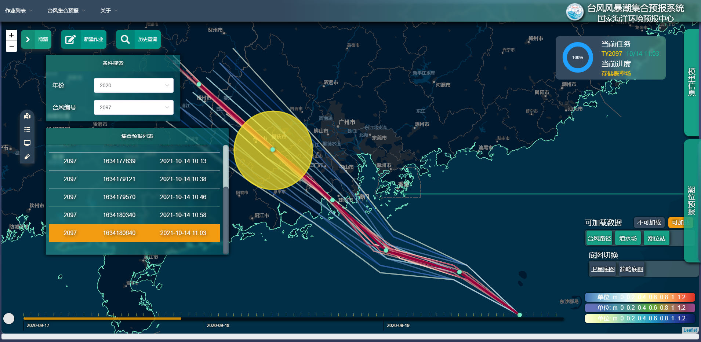
点击时间轴加载对应时刻的台风信息

可以切换色标
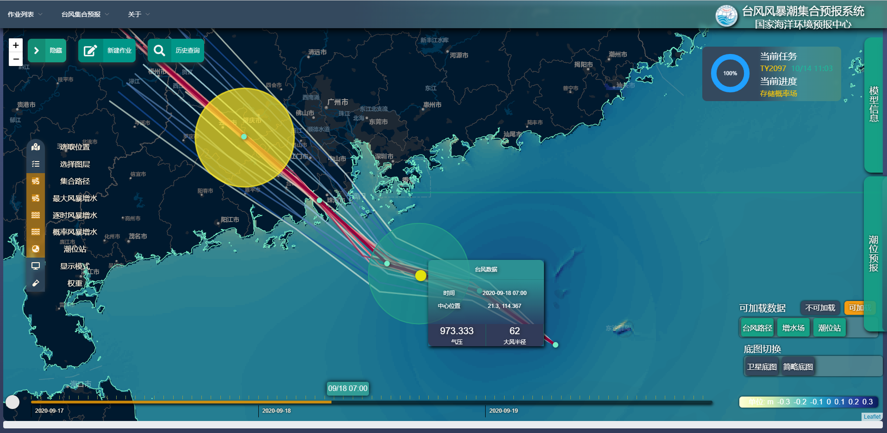
加载概率分布图层
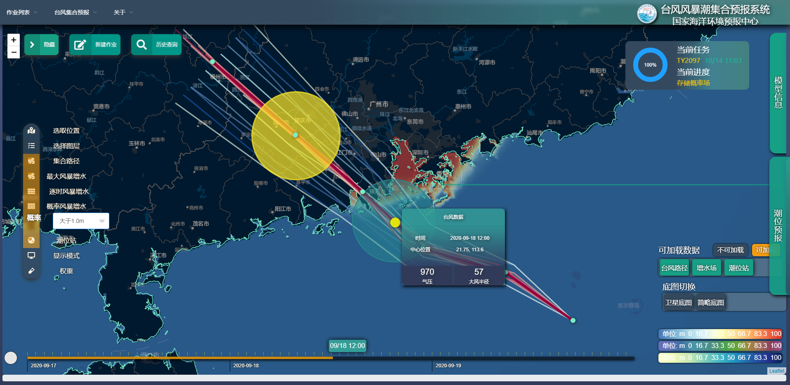
加载对应时刻的台站，脉冲显示并显示对应的四色警戒
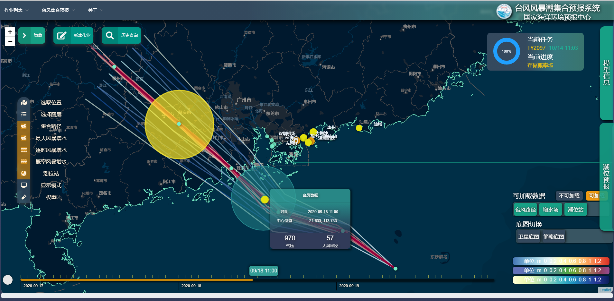
同时加载台站+增水场
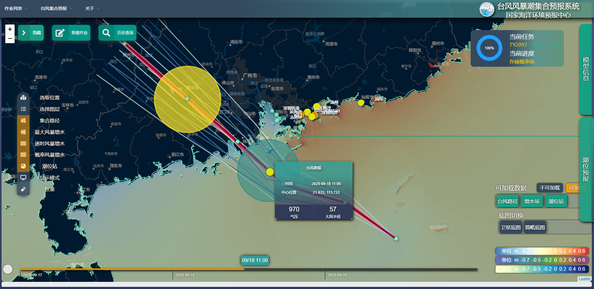
显示粗略海洋站信息
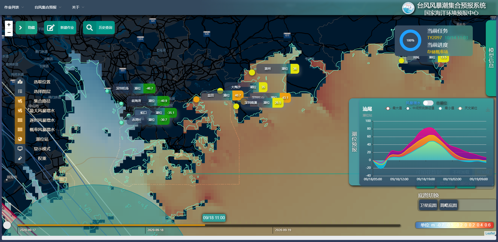
显示详细海洋站信息及右侧对应的潮位预报form
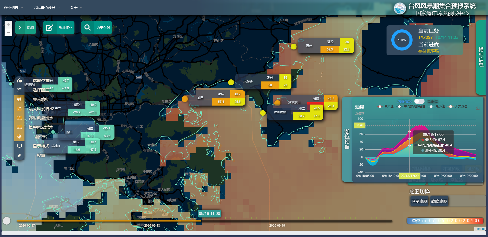
+ 21-11-15 
+ 加入了箱式图显示百分位数
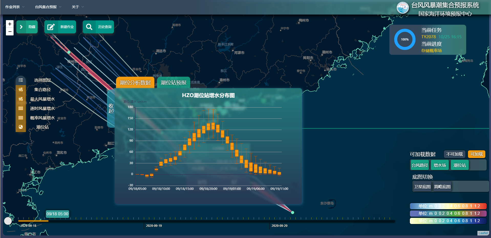
+ 对于数据显示可拖动放大调整尺寸

+ 21-12-22  
  本次基于21-12-10修改意见形成最新的版本  
  本项目于21年4月底开始立项至今也有8个月了，坚持加油 ヾ(◍°∇°◍)ﾉﾞ
+ 对于已经创建完成的作业默认收起task card
+ 统一海洋站icon为5色警戒颜色
+ 每次加载页面默认显示一种色标卡尺(可切换)
+ 对于未加载台风加入时间轴的遮罩
+ 左侧图层栏统一对 `checked` `class` 加入阴影效果
+ 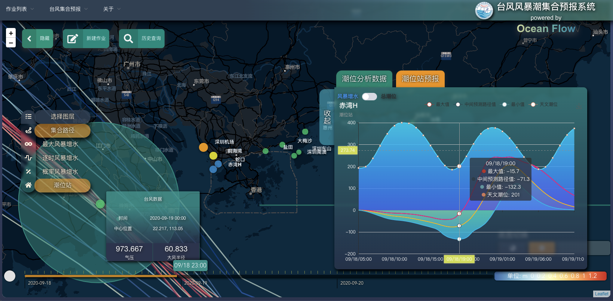

---
+ 22-02-18  
+ 修复了之前由于保留小数点后位数不够造成的集合路径存在偏差的问题
+ 加入了海洋站五色图例
+ 新加入了海洋站静态位置+极值两个新的图层
+ 逐时zoom到最大时显示的是这个时刻的center路径的surge,以及其他所有路径该时刻的范围值
+ 极值zoom到最大时现实的是此次过程的center路径的max surge以及所有路径的范围值
+ 修复了icon layer 原点造成的偏移问题
+ 其他修复
  * 逐时潮位站显示 与 集合路径显示
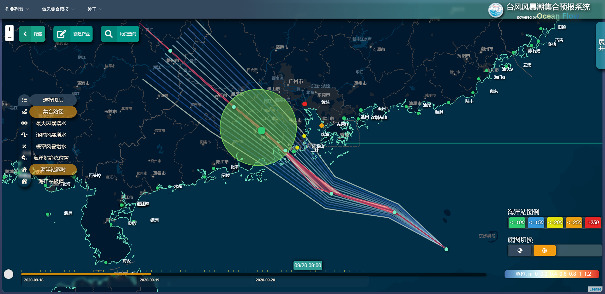
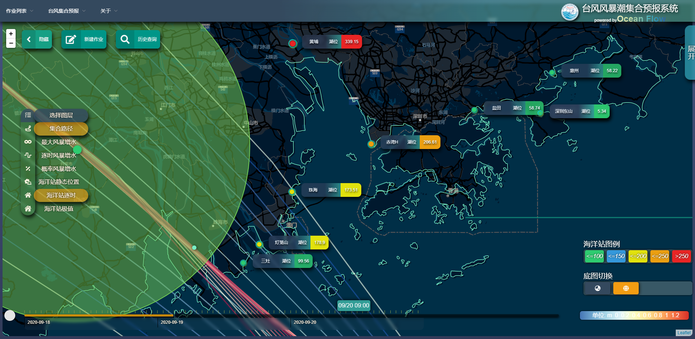
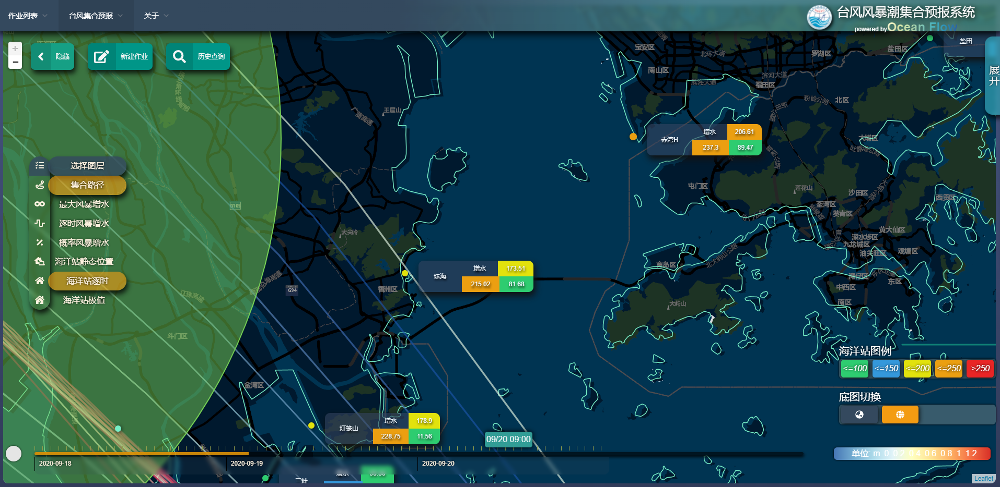
  * 极值潮位站显示

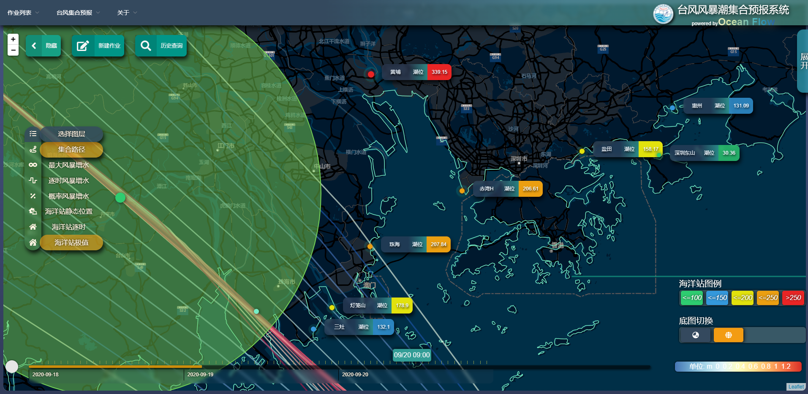