# 台风集合预报(概率预报)路径系统后台
* 前台目前改为私有仓库不再公开
* 靠爱发电，只做展示示意 
* ps: 21-12-07 今年职称又没戏了，不过明年又是新的一年，加油 `(*^▽^*)`
* 2022年了，卧槽燃起来了  
 -  22-01-26  v1.5 版本基本完成，上线还差最后一步环节，前两天身体还是不行了烧到了38.9感觉确实不太好。这个系统开发也有8个月了，期间遭遇过返工，重构以及同事的质疑，不过不管怎么样，坚持做下去，就可以了！在nmefc做开发是一件孤独的事情，不过坚持下来回过头看还是有很多收获，加油！  
 ###  如有共同志向的想伙伴希望可以加入我们，我们的口号是真爱无价靠艾发电~

## 项目文档:
[前端README](./documents/client_readme.md)
[部署README](./documents/项目部署.md)

[用户手册](./documents/user_guide.md)

## 项目架构及所用到的技术

## 项目预览
+ 21-10-15 目前上线测试的 v1.0 版本预览如下:

创建台风基础信息

历史创建case搜索栏

选择创建的case加载台风集合(概率)预报路径

点击时间轴加载对应时刻的台风信息
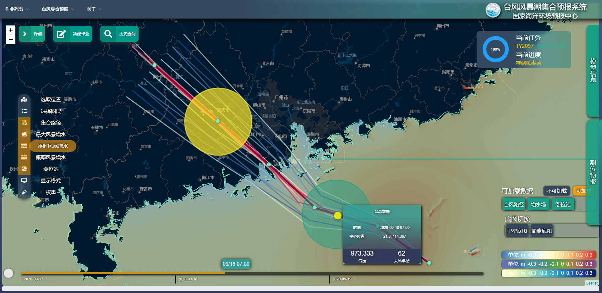
可以切换色标

加载概率分布图层

加载对应时刻的台站，脉冲显示并显示对应的四色警戒

同时加载台站+增水场

显示粗略海洋站信息

显示详细海洋站信息及右侧对应的潮位预报form

+ 21-11-15 
+ 加入了箱式图显示百分位数

+ 对于数据显示可拖动放大调整尺寸

+ 21-12-22  
  本次基于21-12-10修改意见形成最新的版本  
  本项目于21年4月底开始立项至今也有8个月了，坚持加油 ヾ(◍°∇°◍)ﾉﾞ
+ 对于已经创建完成的作业默认收起task card
+ 统一海洋站icon为5色警戒颜色
+ 每次加载页面默认显示一种色标卡尺(可切换)
+ 对于未加载台风加入时间轴的遮罩
+ 左侧图层栏统一对 `checked` `class` 加入阴影效果
+ 

---
+ 22-02-18  
+ 修复了之前由于保留小数点后位数不够造成的集合路径存在偏差的问题
+ 加入了海洋站五色图例
+ 新加入了海洋站静态位置+极值两个新的图层
+ 逐时zoom到最大时显示的是这个时刻的center路径的surge,以及其他所有路径该时刻的范围值
+ 极值zoom到最大时现实的是此次过程的center路径的max surge以及所有路径的范围值
+ 修复了icon layer 原点造成的偏移问题
+ 其他修复
  * 逐时潮位站显示 与 集合路径显示
  
  
  
  * 极值潮位站显示
  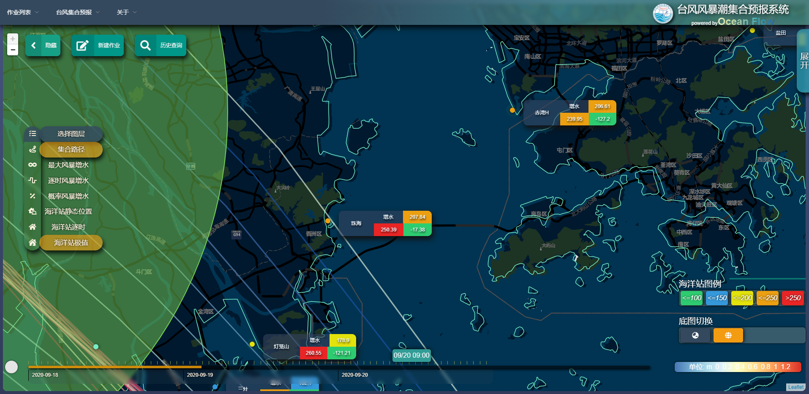
  
+ 22-04-14
+ 重新修改了左侧加载图层
+ 将左侧加载图层的加载逻辑修改为级联操作(个人不喜欢这种操作)
+ 后台加入了可爬取历史cma的功能
+ 前台可加载爬取指定台风的路径
+ 加载台风路径中加入了根据台风种类(热带风暴|强热带风暴|台风|强台|超强台风)渐变的polyline
+ 集合预报路径重构了样式
+ 加入了统一的台风icon
+ 对于台风实况过于密集的情况加入了标准化处理(实况路径以第一个预报路径作为基准间隔时间%6=0)
- 爬取台风路径并在地图中显示
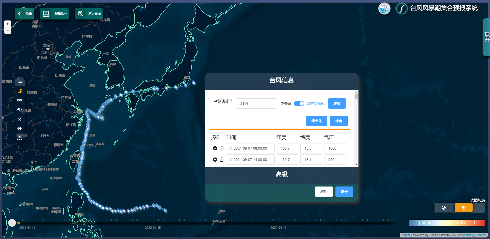
- 标准化路径

- 加载台风集合路径廓线
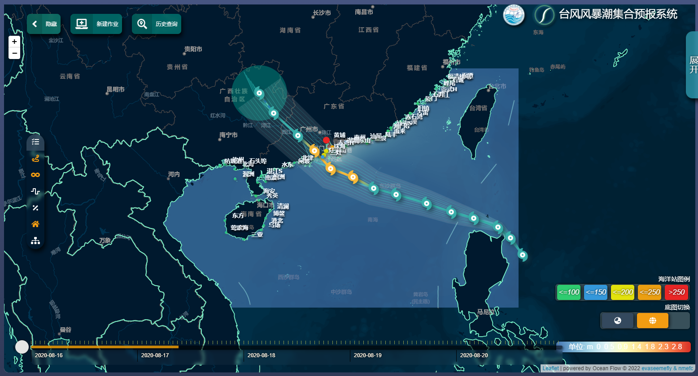
- 集合路径可去掉
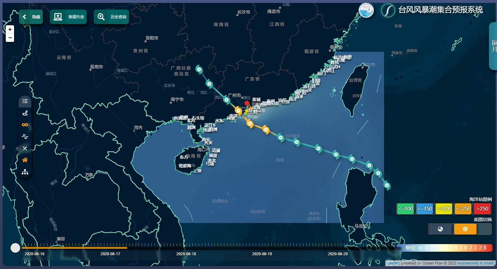
- 根据台风强度(类型)修改了对应的台风标识
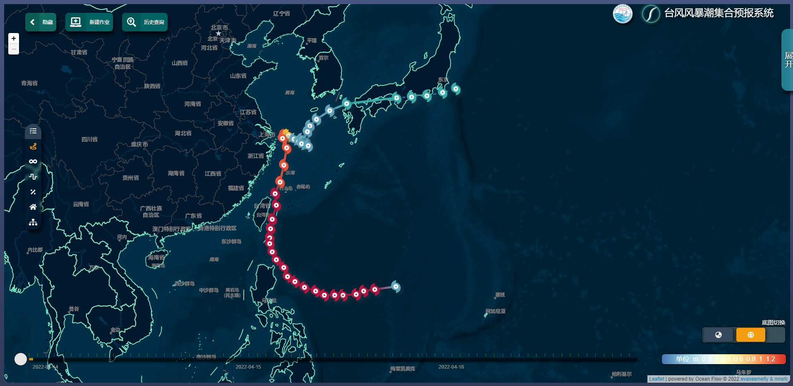
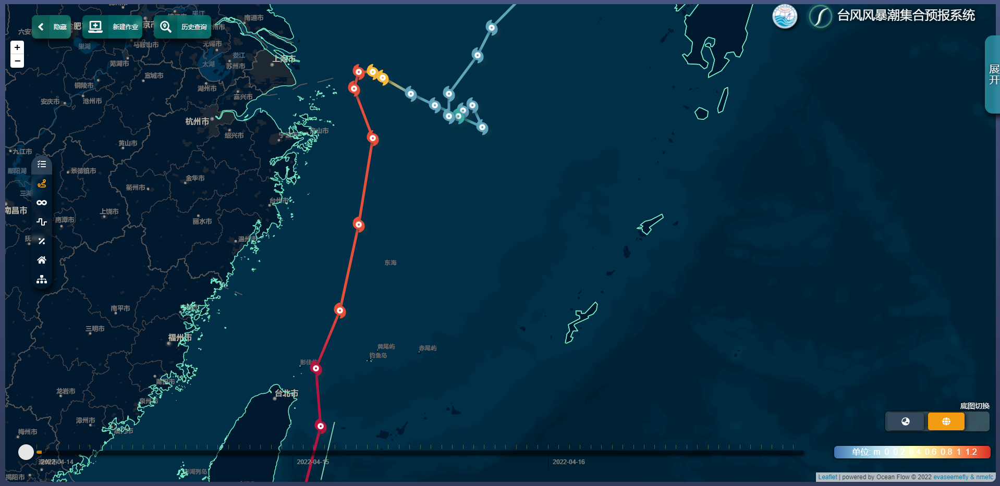
---
+ 22-06-05  
+ 由于每个台风生成的station站点潮位数据约有1000w-5000w行，故对台风编号,eg`2107`进行分表,后端实现了写入分表与读取分表,切记数据迁移时需要加入索引!
+ 尝试在通过geotiff动态发布等值线wms服务，但不适用于大量动态数据的等值线加载  
+ 加载等值线改为由前台加载geotiff并通过`truf`生成等值线，具体流程如下
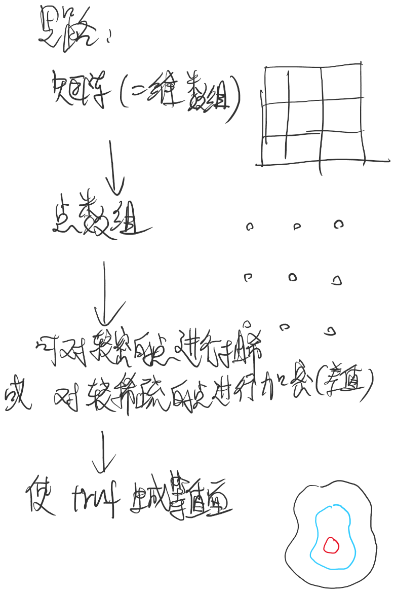
最终实现效果如下:
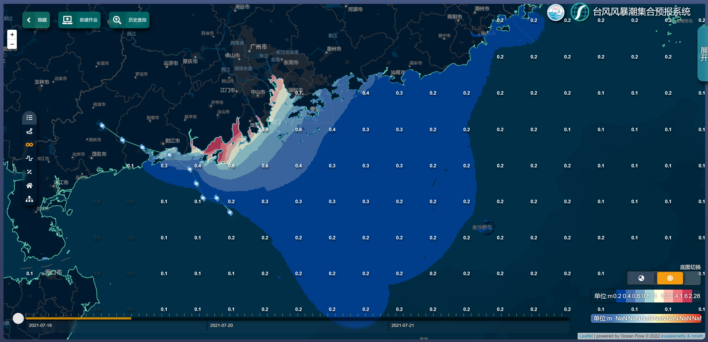
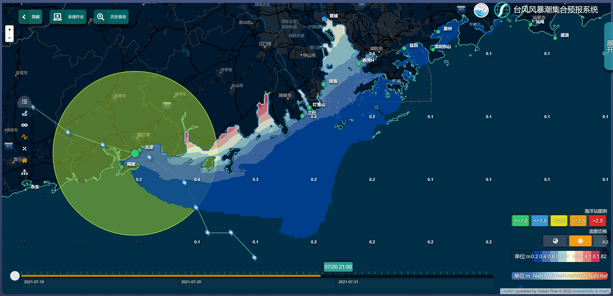
---
+ 22-06-16
+ 加入了 `raster` 与 `isosurface` 动态切换的功能,修复了之前同时加载两份色标的bug;
+ 动态切换时会根据加载的不同layer加载不同形式的`colorbar`;
+ 将之前顺序await修改为链式表达式;
+ 将部分`raster` 与 `isosurface`逻辑进行了重新封装;
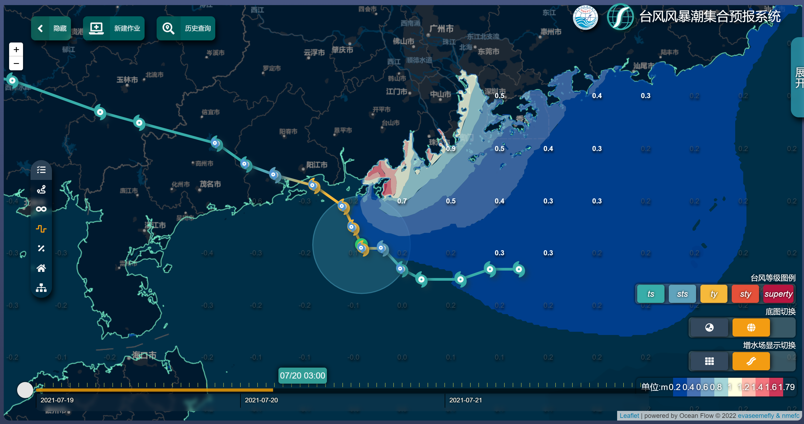
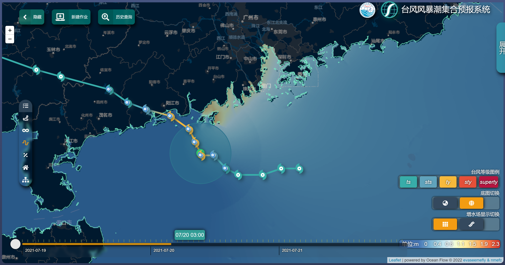
* 目前上存在 逐时增水场 色标为当前过程中 [min,max] 范围 与 等值面色标的 当前时刻的 [min,max]不一致的问题;
+ 获取台风路径 | 加载layer时加入了loading。
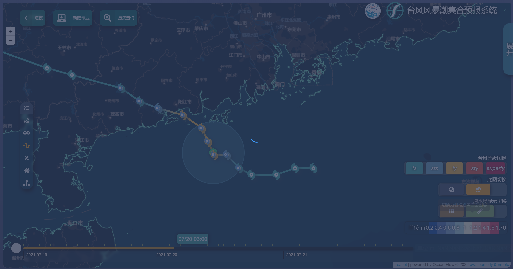