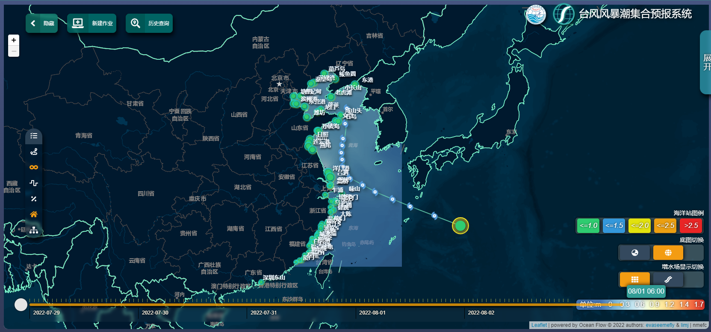
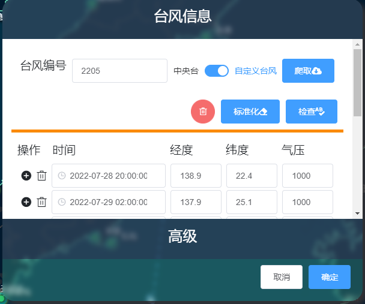
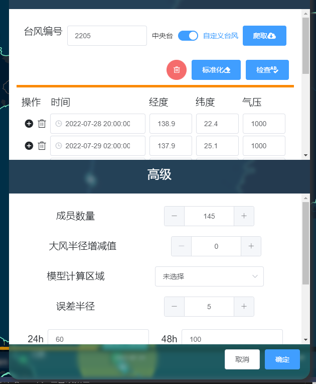
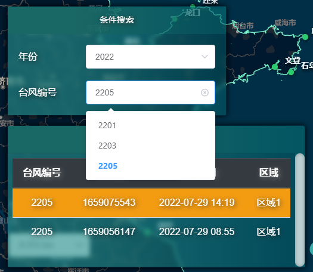
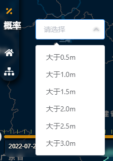
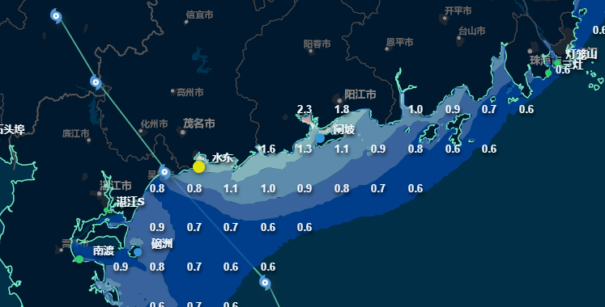
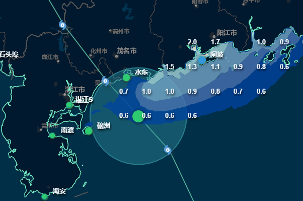
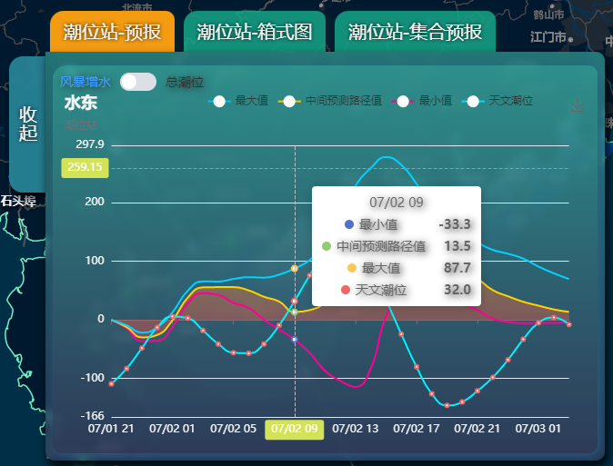
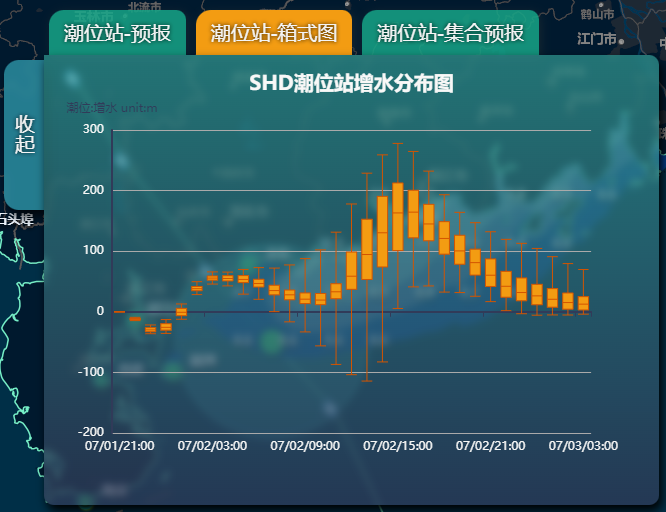
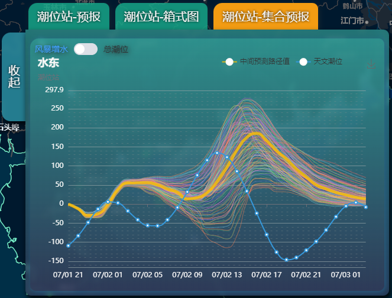

### 用户手册

通过 website:8080/content/TyphoonGroupMap 访问本网站

#### 环境要求：

请使用chrome、360浏览器（切换为极速模式）、win10及以上系统自带的edge浏览器。

系统截图如下

#### 主要功能

##### 创建作业

作业查询

该组件默认为隐藏窗口，点击新建作业后显示需要提交的参数化方案，根据是否爬取台风路径将信息分为爬取路径与自定义台风路径，自定义台风可以自定义路径信息及对应气象信息。

支持从台风网[[1\]](#_ftn1)等网址爬取指定的台风，获取最近的一组实况及预报路径，并支持前台再编辑功能。针对现有模式加入了数据标准化功能，将台风实况及台风预报路径的不同频次（1小时、3小时、6小时等）进行了统一（统一后为6小时/个路径）。可以动态调整默认成员数量、大风半径增减值与成员数量。

创建分为台风信息以及模型编辑信息上下两部分。

台风信息主要为手动触发爬取指定台风编号的台风。

具体操作流程如下:

1. 手动输入四位编号；

2. 切换为自定义台风；

3. 点击爬取按钮；

4. 点击标准化；

5. 可手动剔除不需要的时间的路径，也可进行手动调整台风信息（经纬度与气压）

   * 注意此处需要注意提交的路径必须为时间间隔为6小时的路径信息；

   * v1.0版本请每次提交作业时务必**检查时间间隔是否为6小时**。

     

点击高级弹出模型编辑信息

编辑信息栏主要包含 成员数量，大风半径增减值，模型计算区域以及误差半径等参数信息。

其中需要调整的有 **成员数量** 与 **模型计算区域**。

具体操作流程如下:

1. 根据需要可手动设置成员数量，目前可设置的**成员数量为24/45/145**；
2. 模型计算区域**默认为未选中状态**，注意每次提交运算时都需要**手动选择计算区域**。

参数以及台风路径均编辑无误后，可**点击确定按钮进行提交运算操作**。

* v1.0版本提交作业后需手动刷新页面并选中当前创建作业获取作业计算状态。

##### 作业查询与加载

点击左上操作栏->历史查询按钮，显示搜索栏与集合预报列表

默认会根据选定年份加载该年份最近的一份台风，通过点击**集合预报列表**选择加载对应的计算作业。

- 默认集合预报列表会按照创建的时间降序排列；

- 由于同一个台风需要计算多次加入了**时间戳**用以区分不同时刻提交的作业，也有**创建时间**加以区分。

  

------

[[1\]](#_ftnref1)爬取网址: http://typhoon.nmc.cn/web.html (中央气象台-台风网)

当选择了指定作业后，会将该作业对应的台风路径添加至地图页面，并在加载底部的时间操作栏。

##### 选择预报时间

时间操作栏可显示日期以及该日期对应的24小时时间刻度。

鼠标移入（靠近中间带状区域）会标识对应位置的时间，鼠标点击可选定该预报时刻。

##### 加载图层

页面左侧为可选的加载项目，选中为橙色高亮显示，鼠标移入会显示对应的栏目文字描述

可加载项目主要有

1. ###### 集合路径

   可加载集合预报轮廓

2. ###### 最大风暴增水

   加载该过程最大风暴增水场的栅格或等值面图层

3. ###### 逐时风暴增水

   加载对应时刻的风暴增水场栅格或等值面图层

4. ###### 概率风暴增水

   

   可选择增水大于对应值的概率增水场栅格或等值面图层

5. ###### 海洋站

   加载海洋站图层

   * 当未选中最大风暴增水或逐时风暴增水会显示海洋站静态示意；

   * 当选择**最大风暴增水场**同时**选择海洋站**会显示整个过程中的该区域的**所有海洋站的极值情况**，并根据极值的大小海洋站圆形半径会有所区分，并根据增水对应的等级**显示不同颜色**（对应右下海洋站图例）；

     

   * 当选择**逐时风暴增水场**同事**选择海洋站**会显示当前选中时间的该区域的所有海洋站的当**前时刻的增水情况**。

     

   点击海洋站可以加载该海洋站在本次过程中的增水曲线图。

##### 海洋站charts图

点击某个海洋站可以加载对应海洋站的所有charts图。

1. ###### 潮位站-预报

   潮位站预报chart图为该站点整个过程中的最大、中间预测路径、最小增水曲线以及天文潮曲线；点击总潮位可切换为实际潮位（增水+天文潮）曲线。

2. ###### 潮位站-箱式图

   

   潮位站箱式图chart为该站点的所有预报路径对应的该站点的增水分布图。其中箱式图显示的为极大值、3/4百分位数、中位数、1/4百分位数以及极小值。

3. ###### 潮位站-集合预报

   ​	

   潮位站集合预报chart图为该站点所有预报路径对应的增水曲线，以及天文潮位曲线；点击总潮位可切换为实际潮位（增水+天文潮）曲线。

   注意加载该视图会略有卡顿。

   #### 注意事项

   * 切换海洋站时，最好将chart图层的切换为潮位站-预报页面，这样可以减少加载可能造成的页面卡顿；
   * 若出现任何bug请直接刷新页面。

